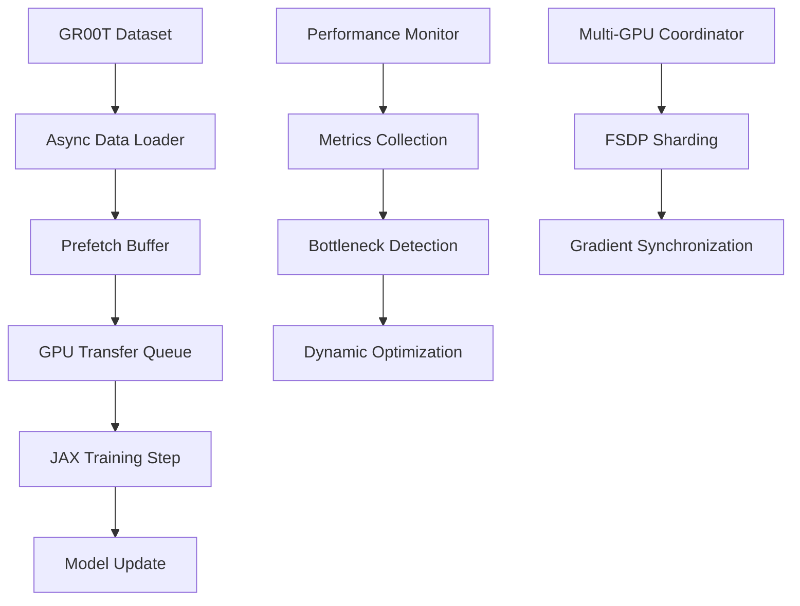

# Design Document

## Overview

The current OpenPI training pipeline with GR00T dataset integration suffers from poor GPU utilization due to several bottlenecks in the data loading and processing pipeline. The main issues identified are:

1. **Data Loading Bottlenecks**: The current PyTorch DataLoader with limited prefetching causes GPU starvation
2. **JAX Compilation Overhead**: JIT compilation happens synchronously, blocking GPU computation
3. **Memory Transfer Inefficiencies**: Data transfer from CPU to GPU is not optimized
4. **Suboptimal Multi-GPU Configuration**: JAX requires global context management, making DDP-style training problematic
5. **GR00T Dataset Processing**: Video decoding and action transforms happen synchronously in the main thread

The solution involves implementing an asynchronous data pipeline with proper prefetching, optimizing JAX compilation patterns, and implementing efficient multi-GPU training within JAX's paradigm.

## Architecture

### High-Level Data Flow



### Component Architecture

1. **Asynchronous Data Pipeline**
   - Multi-process data loading with increased worker count
   - Async video decoding using background threads
   - Circular buffer for batch prefetching
   - Memory-mapped dataset caching

2. **GPU Utilization Optimizer**
   - JIT compilation cache warming
   - Overlapped computation and data transfer
   - Dynamic batch size adjustment
   - Memory usage monitoring

3. **Multi-GPU Training Manager**
   - JAX-native FSDP implementation
   - Efficient gradient synchronization
   - Load balancing across devices
   - Memory-aware model sharding

4. **Performance Monitoring System**
   - Real-time GPU utilization tracking
   - Data loading bottleneck detection
   - Automatic performance tuning
   - Comprehensive metrics logging

## Components and Interfaces

### 1. AsyncDataLoader

```python
class AsyncDataLoader:
    def __init__(
        self,
        dataset: Dataset,
        batch_size: int,
        num_workers: int,
        prefetch_factor: int,
        pin_memory: bool = True,
        persistent_workers: bool = True,
    ):
        # Enhanced PyTorch DataLoader with optimized settings
        
    def __iter__(self) -> Iterator[Batch]:
        # Yields batches with async prefetching
        
    def get_performance_stats(self) -> Dict[str, float]:
        # Returns data loading performance metrics
```

### 2. GPUUtilizationMonitor

```python
class GPUUtilizationMonitor:
    def __init__(self, target_utilization: float = 0.8):
        # Initialize monitoring with target utilization threshold
        
    def start_monitoring(self):
        # Begin background monitoring thread
        
    def get_current_utilization(self) -> float:
        # Get real-time GPU utilization
        
    def detect_bottlenecks(self) -> List[BottleneckType]:
        # Identify performance bottlenecks
        
    def suggest_optimizations(self) -> List[OptimizationSuggestion]:
        # Provide actionable optimization recommendations
```

### 3. JaxTrainingOptimizer

```python
class JaxTrainingOptimizer:
    def __init__(self, config: TrainConfig):
        # Initialize with training configuration
        
    def warm_compilation_cache(self, sample_batch: Batch):
        # Pre-compile JAX functions with sample data
        
    def optimize_memory_layout(self, model_state: TrainState):
        # Optimize memory allocation patterns
        
    def create_optimized_train_step(self) -> Callable:
        # Create JIT-compiled training step with optimizations
```

### 4. MultiGPUCoordinator

```python
class MultiGPUCoordinator:
    def __init__(self, mesh: jax.sharding.Mesh):
        # Initialize with JAX mesh for multi-GPU coordination
        
    def setup_fsdp_sharding(self, model_state: TrainState) -> TrainState:
        # Configure FSDP sharding for model parameters
        
    def synchronize_gradients(self, gradients: Gradients) -> Gradients:
        # Efficiently synchronize gradients across devices
        
    def balance_workload(self, batch: Batch) -> List[Batch]:
        # Distribute batch across available devices
```

### 5. Gr00tDatasetOptimizer

```python
class Gr00tDatasetOptimizer:
    def __init__(self, spec: Gr00tDatasetSpec):
        # Initialize with GR00T dataset specification
        
    def setup_async_video_decoding(self):
        # Configure background video decoding
        
    def optimize_episode_caching(self):
        # Implement intelligent episode caching strategy
        
    def parallelize_action_transforms(self):
        # Parallelize GR00T action transformations
```

## Data Models

### Performance Metrics

```python
@dataclass
class PerformanceMetrics:
    gpu_utilization: float
    data_loading_time: float
    forward_pass_time: float
    backward_pass_time: float
    gradient_sync_time: float
    memory_usage: float
    batch_processing_rate: float
    bottleneck_type: Optional[BottleneckType]
```

### Optimization Configuration

```python
@dataclass
class OptimizationConfig:
    target_gpu_utilization: float = 0.85
    max_prefetch_batches: int = 4
    enable_async_video_decoding: bool = True
    use_memory_mapping: bool = True
    dynamic_batch_sizing: bool = True
    compilation_cache_size: int = 100
    gradient_sync_strategy: str = "async"
```

### Training State Extensions

```python
@dataclass
class OptimizedTrainState(TrainState):
    performance_metrics: PerformanceMetrics
    optimization_config: OptimizationConfig
    compilation_cache: Dict[str, Any]
    prefetch_buffer: Queue[Batch]
```

## Error Handling

### Data Loading Errors
- **Video Decoding Failures**: Implement fallback mechanisms and error recovery
- **Memory Exhaustion**: Dynamic batch size reduction and memory cleanup
- **Worker Process Crashes**: Automatic worker restart and load redistribution

### GPU Communication Errors
- **NCCL Failures**: Implement retry logic with exponential backoff
- **Memory Fragmentation**: Periodic memory defragmentation and reallocation
- **Device Synchronization Issues**: Robust synchronization barriers and timeout handling

### Performance Degradation
- **Utilization Drops**: Automatic bottleneck detection and mitigation
- **Memory Leaks**: Periodic memory usage auditing and cleanup
- **Compilation Cache Misses**: Intelligent cache warming and management

## Testing Strategy

### Unit Tests
1. **AsyncDataLoader Tests**
   - Verify correct batch ordering and completeness
   - Test prefetching behavior under various conditions
   - Validate memory usage patterns

2. **GPU Utilization Monitor Tests**
   - Mock GPU metrics and verify detection accuracy
   - Test bottleneck identification algorithms
   - Validate optimization suggestion logic

3. **Multi-GPU Coordinator Tests**
   - Test FSDP sharding correctness
   - Verify gradient synchronization accuracy
   - Validate load balancing algorithms

### Integration Tests
1. **End-to-End Training Pipeline**
   - Test complete training loop with optimizations
   - Verify model convergence with enhanced pipeline
   - Validate performance improvements

2. **GR00T Dataset Integration**
   - Test async video decoding with real datasets
   - Verify action transform parallelization
   - Validate episode caching effectiveness

3. **Multi-GPU Training**
   - Test scaling across different GPU counts
   - Verify memory efficiency improvements
   - Validate training speed improvements

### Performance Tests
1. **Benchmark Comparisons**
   - Compare GPU utilization before/after optimizations
   - Measure training throughput improvements
   - Analyze memory usage efficiency

2. **Stress Testing**
   - Test with large batch sizes and datasets
   - Verify stability under high GPU utilization
   - Test recovery from various failure scenarios

3. **Scalability Testing**
   - Test performance across 1, 2, 4, 8 GPU configurations
   - Measure scaling efficiency and bottlenecks
   - Validate memory usage scaling patterns

## Implementation Phases

### Phase 1: Data Loading Optimization
- Implement AsyncDataLoader with enhanced prefetching
- Add GPU utilization monitoring
- Optimize GR00T dataset video decoding

### Phase 2: JAX Training Optimization
- Implement JIT compilation cache warming
- Add memory layout optimizations
- Create optimized training step functions

### Phase 3: Multi-GPU Enhancement
- Implement JAX-native multi-GPU coordination
- Optimize FSDP sharding strategies
- Add efficient gradient synchronization

### Phase 4: Performance Monitoring & Auto-tuning
- Add comprehensive performance metrics collection
- Implement automatic bottleneck detection
- Add dynamic optimization adjustments